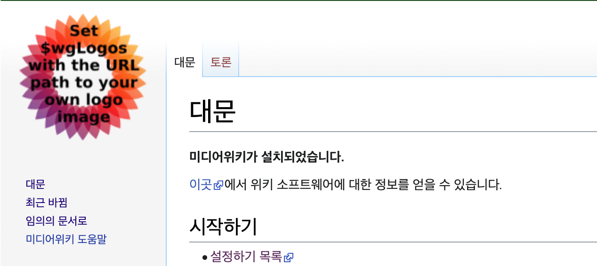

# 로고 변경

미디어위키 왼쪽 상단에 위치한 로고를 변경하기 위해서는 `LocalSettings.php` 파일에 위치한 `$wgLogos` 변수를 설정해야 한다.



1. 미디어 위키가 설치된 서버 접속
2. `LocalSettings.php` 파일을 열어 `$wgLogos` 변수를 찾는다.

```shell
> cat LocalSettings.php | grep --color '$wgLogos'
$wgLogos = [ '1x' => "$wgResourceBasePath/resources/assets/wiki.png" ];
```

3. ./resources/assets/ 디렉토리에 로고 파일을 업로드한다.
4. `$wgLogos` 변수의 값을 변경할 로고 파일의 경로로 수정한다.

* 로고의 권장 크기는 135x135px 이다.

```shell

## Reference
[인터페이스 바꾸기-로고 변경하는 방법은?](https://www.mediawiki.org/wiki/Manual:FAQ/ko#%EB%A1%9C%EA%B3%A0_%EB%B3%80%EA%B2%BD%ED%95%98%EB%8A%94_%EB%B0%A9%EB%B2%95%EC%9D%80?)